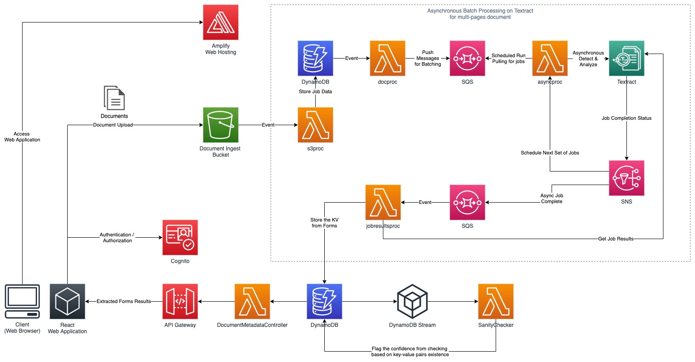

# Textract Document Processing

## Overview
This project is derived from the [Large scale document processing with Amazon Textract](https://github.com/aws-samples/amazon-textract-serverless-large-scale-document-processing) as the base / foundation so all credits goes to the initial Contributor in the linked project page.

## Architecture
The following is the high-level architecture diagram.



The project leverage on Amazon Textract Asynchronous multi-page processing. It supports detecting and analyzing multi-page PDF files. The workflow is as follows:
1. Documents is being uploaded into S3 Ingest Bucket with name `documentsbucket`
2. S3 Ingest Bucket will trigger S3 object created event to `s3proc` Lambda Function which will register the document and job information into a DynamoDB table called `DocumentsTable`
3. DynamoDB Stream will trigger the `docproc` Lambda Function which will enqueue a message into SQS to list the document as part of the next batch of processing
4. A Lambda Function with name `asyncproc` is scheduled to run every x minutes that will poll the message from the SQS and will submit the text detection and analysis job to Amazon Textract.
5. Amazon Textract will process the job asynchronously, once finished it sends the job completed notification to SNS which will post a message into SQS and will trigger a Lambda Function called `jobresultsproc`.
6. `jobresultsproc` Lambda Function will retrieve the job results, parse it, and will store the detected forms / key-value pairs information into a DynamoDB table called `DocumentMetadata`.
7. A DynamoDB Stream will trigger the `SanityChecker` Lambda Function that will evaluate the results. The evaluation status will be updated on the record. The evaluation criterias is flexible and can be modified as required by the business logic.
8. Clients can retrieve the data stored in the DynamoDB table by using Lambda Function `DocumentMetadataController` that is exposed using API Gateway. The API Gateway receive authorization using Cognito Client Credentials flow. Sample of the API call is described in this [section](#api-call-to-the-api-gateway-to-fetch-the-document-metadata).

## Deploying the Solution

### Prerequisites
1. Install NPM here if you haven't: https://www.npmjs.com/get-npm
2. Install CDK, refer here: https://docs.aws.amazon.com/cdk/latest/guide/getting_started.html#getting_started_install

### Steps
1. Clone the repository
2. Go to the `textract-pipeline` directory and run `npm install` to restore the packages
3. Bootstrapping CDK deployment in your AWS account `cdk bootstrap`
4. Deploy the stack `cdk deploy`
5. Delete the stack `cdk destroy`

### Testing
1. Go to the Amazon S3 Bucket `textractpipeline-documentsbucketxxxx` created by the stack and upload some documents (pdf).
2. You will be able to see the output of the key-value / forms extraction in the DynamoDB Table `textractpipelineStack-DocumentMetadataTablexxxx`
3. Fetch the results using HTTP API call, example is described in this [section](#api-call-to-the-api-gateway-to-fetch-the-document-metadata).
4. Troubleshoot issues by checking on CloudWatch Logs

## Cost Estimates
The following is the cost estimate based on assumptions.
https://calculator.aws/#/estimate?id=b3061df249a2bf8b3cd7563307f67ad3c54837d5

The calculator at the moment does not list the Cognito and Amazon Textract service, so please refer to both [Cognito](https://aws.amazon.com/cognito/pricing/) and [Amazon Textract](https://aws.amazon.com/textract/pricing/) pricing page.

Cognito is priced based on the number of Monthly Active Users (MAU), there is a free tier of 50K MAUs that does not expire. Beyond free tier, it is charged starting from $0.0055 per MAU.

Amazon Textract Pricing is as follows:
1. Detect Document Text: 
    - $0.0022 per page for the first million
    - $0.00085 per page for over 1 million.
    - 
2. Analyze Document with Forms pricing is as follows:
    - $0.073 per page for the first million
    - $0.058 per page for over 1 million

Assumed there are 1000 pages, the costs would be $2.2 + $ 73 = $75.2

## API Call to the API Gateway to fetch the document metadata
In order to fetch the document metadata, the client must authenticate to Cognito service first.
The supported authentication in this POC is client credentials flow using client app id and client app secret. The client app id and client app secret can be retrieved from the Cognito on AWS Management Console.

There are 2 resources that is exposed by the API Gateway.

| Resource | Method | Description |
| ---- | ---- | ---- |
| / | GET | Get all items in the Document Metadata |
| /{documentId} | GET | Get a specific item by documentId in the Document Metadata |

The following is an example of creating authenticated HTTP request using `curl` in Linux.

````
clientid=<app-client-id>
clientsecret=<app-client-secret>
cognitodomain=https://<cognito-domain>.auth.ap-southeast-1.amazoncognito.com
apigatewayendpoint=https://<api-gateway-id>.execute-api.ap-southeast-1.amazonaws.com/prod
documentId=<documentId>

accesstoken=$(curl -X POST --user $clientid:$clientsecret "${cognitodomain}/oauth2/token?grant_type=client_credentials&scope=https://documentmetadata/read" -H "Content-Type: application/x-www-form-urlencoded" | jq -r ".access_token")

curl -X GET "${apigatewayendpoint}/${documentId}" -H "Content-Type: application/json" -H "Authorization:${accesstoken}"
````

## Development
### Setting up and Deployment
1. Clone the repository
2. Go to the `textract-pipeline` directory and run `npm install` to restore the packages
3. Produce and view CloudFormation template if needed `cdk synth`
4. Produce and export CloudFormation template if needed `cdk synth -o textractcf`
5. Deploy changes `cdk bootstrap` and `cdk deploy`

### Source Code
| File | Description |
| ---- | ---- |
| s3processor/lambda_function.py | Lambda function that handles s3 event for an object creation. |
| documentprocessor/lambda_function.py | Lambda function that push documents to queues for sync or async pipelines. |
| asyncprocessor/lambda_function.py | Lambda function that takes documents from a queue and start async Amazon Textract jobs. |
| jobresultsprocessor/lambda_function.py | Lambda function that process results for a completed Amazon Textract async job. |
| docmetadatacontroller/lambda_function.py | Lambda function that fetch the document metadata from DynamoDB DocumentMetadata table and return it to the clients |
| sanitychecker/lambda_function.py | Lambda function that performs verification based on rules such as key-value pairs existence and update the record in the DynamoDB DocumentMetadata table with the verification status. |
| lib/textract-pipeline-stack.ts | CDK code to define infrastrucure including IAM roles, Lambda functions, SQS queues etc. |

### CI/CD environment
You can create a simple CodePipeline with CodeBuild to continuously deploy changes by using the `buildspec.yml` in the root directory.